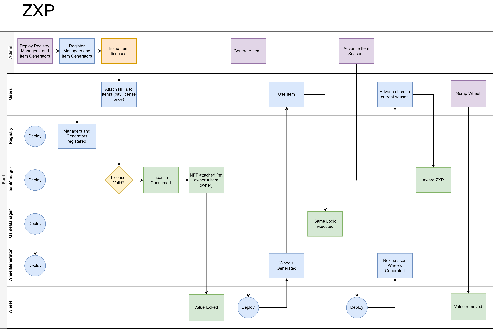

ZXP

An NFT gameplay system that rewards experience points for active participation, with item upgrades that preserve immutability.

ZXP licenses ERC-721 token owners to "attach" them to the game system as items. 
The item has some itemType, such as Wheel or Kick, and can participate in parts of the gameplay system that item type has access to. 
The item is always implicitly owned by the original NFT owner, effectively detaching ZXP from the actual NFT release process so that it can be compatible with already existing NFT systems. 

Arbitrary item types and games can be added, and items can be upgraded.
Items are upgraded with the Bancor upgrade pattern, but with the added notion of seasons. 
Seasons reward users for active participation, and create a deflationary supply of historic items. 

Items are broken into two systems, Generators and Generated.
Generators allow "loot box" like release of items - ownership of an item can be attained before the stats and functionality are set.
This system is agnostic to how deterministic the generated stats/functions are - it is up to the admin to decide how each item should be generated.



```shell
npx hardhat accounts
npx hardhat compile
npx hardhat clean
npx hardhat test
npx hardhat node
node scripts/sample-script.js
npx hardhat help
```
